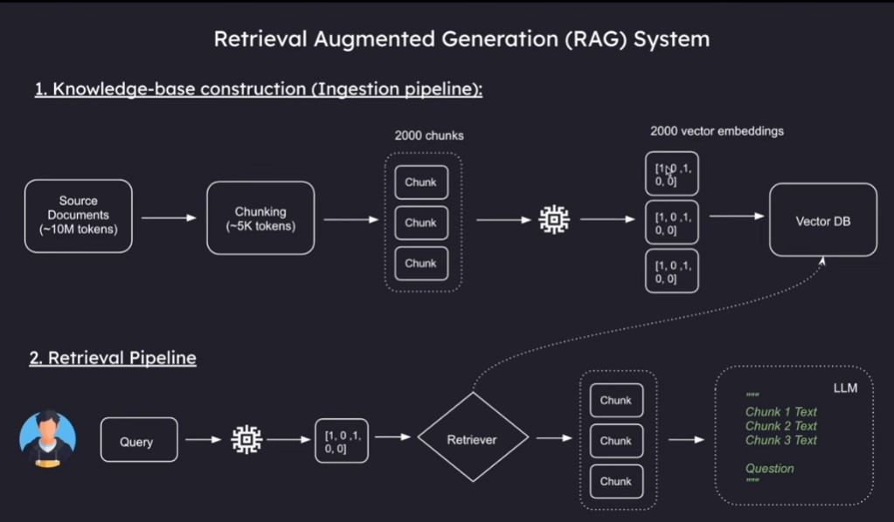

## RAG
- RAG (Retrieval-Augmented Generation) 
- RAG is a specialized architecture designed to enhance the performance of LLMs. 
- LLMs can process only a limited number of documents at a time, but they cannot handle large volumes of data efficiently. RAG helps solve this problem.
-----------
## Ingestion, Retrieval, Generator

  

### 1. Ingestion:
>The process of loading data/documents, splitting them into chunks, converting them into embeddings, and storing them in a vector database.
### 2. Retrieval:
> The process of converting the user query into an embedding and retrieving the most relevant matching vectors from the vector database.
### 3. Generation:
> The process of generating a response based on the user query and the retrieved relevant context.

