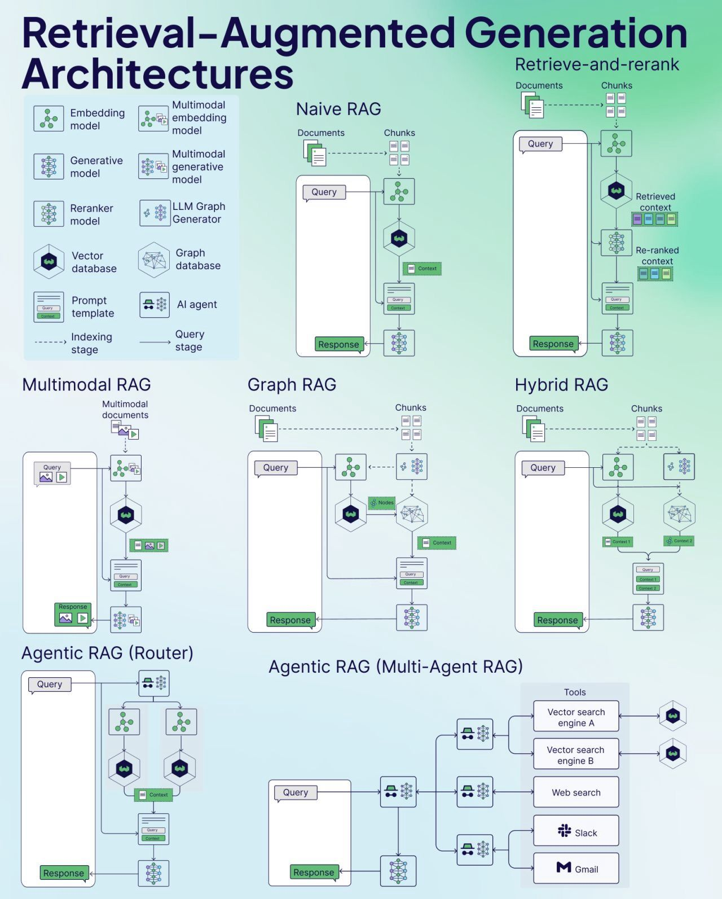

# All RAG Apps


# Environment setup
> Install python 3.11
```
conda create -p RAG_py3.11 python==3.11

```

> Idendify conda environments
```
conda info --envs
```

> Activating the environment.
```
conda activate E:\Gen_AI\ALL_RAG_Apps\RAG_py3.11
```

> Install required libreries
```
pip install -r requirements.txt
```
## Delete Packages / Environments.

> Uninstall any langchain libreries if required

```
pip uninstall -y langchain langchain-core langchain-community
```

> Deactivate current python env
```
conda deactivate
```

> Delete current python env
```
conda env remove --prefix E:\Gen_AI\ALL_RAG_Apps\RAG_py3.11
```
